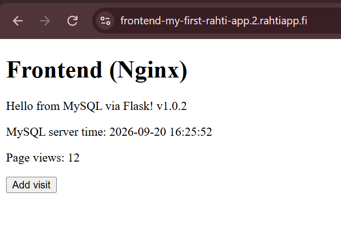
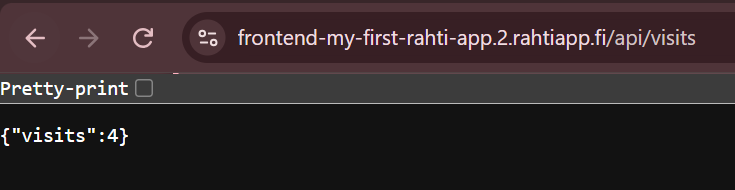
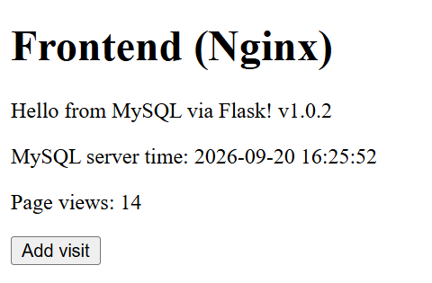
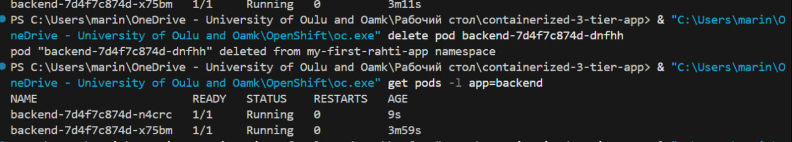
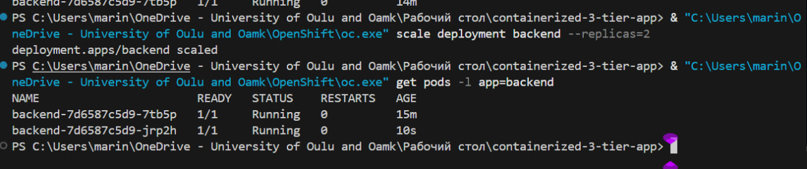
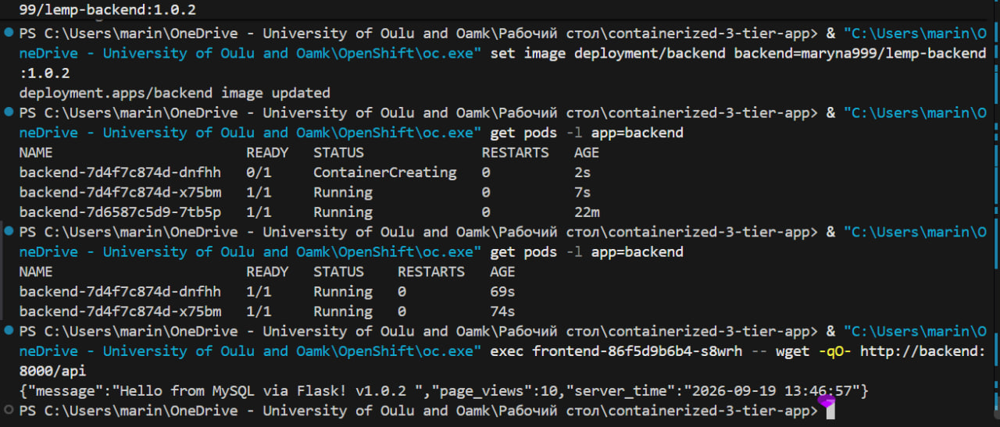
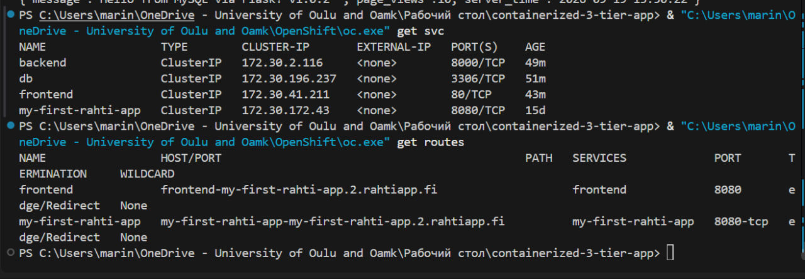

# Containerized 3-Tier Web Application

## 1. Project Overview

This project is a containerized 3-tier web application with a frontend, backend and MySQL database.

The application was first developed and tested locally using Docker Compose. After that, it was deployed to OpenShift/Rahti.

The application allows the user to view data from MySQL and increase a page view counter through the frontend.

### Technologies used

- Nginx - frontend web server and reverse proxy
- Flask - backend REST API
- MySQL 8.4 - database
- Docker - containerization
- Docker Compose - local deployment
- Docker Hub - container image registry
- OpenShift / Rahti - cloud deployment
- PersistentVolumeClaim (PVC) - persistent database storage
- ConfigMap - application configuration
- Secret - database passwords
- Redis - in-memory data store used for the visit counter

## 2. Architecture

The application consists of three main layers:

```text
                                             Internet
                            |
                            v
                    OpenShift Route
                            |
                            v
                    +---------------+
                    |   Frontend    |
                    |     Nginx     |
                    +-------+-------+
                            |
                          /api
                            |
                            v
                    +---------------+
                    |    Backend    |
                    | Flask / Python|
                    +-------+-------+
                            |
                 +----------+----------+
                 |                     |
                 v                     v
          +-------------+       +-------------+
          |    MySQL    |       |    Redis    |
          |  Database   |       | In-memory   |
          | Persistent  |       |    store    |
          |   storage   |       +-------------+
          +-------------+
The frontend communicates with the Flask backend through the /api endpoint.
The backend uses MySQL for persistent application data and Redis for the visit counter.
MySQL data is stored on persistent storage, while Redis is used as an in-memory data store for fast counter operations.
The frontend is the only part exposed to the Internet.
The backend, MySQL and Redis use internal OpenShift Services and are not directly exposed outside the cluster.
```

  ## 3. Project Structure

```text
containerized-3-tier-app/
│
├── backend/
│   ├── app.py
│   ├── Dockerfile
│   └── requirements.txt
│
├── db/
│   └── init/
│       └── init.sql
│
├── frontend/
│   ├── Dockerfile
│   ├── index.html
│   └── nginx.conf
│
├── rahti/
│   ├── backend-deployment.yaml
│   ├── backend-service.yaml
│   ├── configmap.yaml
│   ├── frontend-deployment.yaml
│   ├── frontend-service.yaml
│   ├── frontend-route.yaml
│   ├── mysql-deployment.yaml
│   ├── mysql-pvc.yaml
│   ├── mysql-service.yaml
│   ├── redis-deployment.yaml
│   └── redis-service.yaml
│
├── screenshots/
│   ├── application-update.jpg
│   ├── final-state.jpg
│   ├── local-app.png
│   ├── network-test.jpg
│   ├── persistence-test.jpg
│   ├── pod-recovery.png
│   ├── read-write-test.png
│   ├── scale-test.png
│   └── wget.jpg
│
├── .gitignore
├── docker-compose.dev.yml
├── docker-compose.prod.yml
├── docker-compose.yml
└── README.md
```

Main directories
backend/ contains the Flask application and backend Dockerfile.

frontend/ contains the Nginx configuration and frontend page.

db/ contains the initial MySQL database setup.

rahti/ contains the OpenShift deployment manifests.

docker-compose*.yml files are used for local Docker deployment.

## 4. Application Functionality

The frontend communicates with the Flask backend through the /api endpoint.

The backend reads the following information from MySQL:

MySQL server time
Current page view count

The application also has an Add visit button.

When the button is pressed, the frontend sends a POST request to /api/visit. The backend then increases the page_views counter in MySQL.

Redis was added to the application as an additional in-memory data store.

The backend connects to Redis using the REDIS_HOST environment variable.

The /api/visits endpoint uses Redis to increment and return a visit counter.

The Redis counter is increased using the Redis INCR operation.

This demonstrates communication between the Flask backend and the Redis service.

The application therefore demonstrates two different types of data storage:

MySQL stores persistent application data such as the page view counter.
Redis stores the visit counter in memory and provides fast counter operations.

This was used to test both reading and writing data between the application and the database, as well as communication between the backend and Redis.

## 5. Local Docker Deployment

The application was first tested locally using Docker Compose.

The development environment was started with:

docker compose -f docker-compose.dev.yml --env-file .env up --build -d

The application was available locally at:

http://localhost:8080

The local test confirmed that:

Nginx served the frontend.
Flask handled the API requests.
Flask successfully connected to MySQL.
MySQL returned the server time and page view count.
The page view counter could be increased using the Add visit button.

## 6. Docker Images

The application images were built and pushed to Docker Hub.

Backend
maryna999/lemp-backend:1.0.0
maryna999/lemp-backend:1.0.1
maryna999/lemp-backend:1.0.2
Frontend
maryna999/lemp-frontend:1.0.0
maryna999/lemp-frontend:1.0.1
maryna999/lemp-frontend:1.0.2

Versioned image tags were used so that application updates could be tested between different versions.

## 7. OpenShift / Rahti Deployment

The application was deployed to the my-first-rahti-app OpenShift project.

The following resources were created:

Resource	Purpose
frontend Deployment	Runs the Nginx frontend
frontend Service	Provides internal access to the frontend
frontend Route	Exposes the frontend to the Internet
backend Deployment	Runs the Flask backend
backend Service	Provides internal access to the backend
db Deployment	Runs MySQL
db Service	Provides internal access to MySQL
mysql-pvc	Provides persistent storage for MySQL
redis Deployment	Runs the Redis server
redis Service	Provides internal access to Redis
app-config ConfigMap	Stores non-sensitive application configuration
mysql-secret Secret	Stores database passwords

The final application contains the frontend, backend, MySQL and Redis components.

The backend, database and Redis Services use ClusterIP and are only accessible inside the OpenShift cluster.

## 8. Configuration
The ConfigMap contains non-sensitive database configuration:

DB_HOST=db
DB_USER=appuser
DB_NAME=appdb
REDIS_HOST=cache

The REDIS_HOST variable tells the Flask backend where the Redis service is located.

Inside the OpenShift cluster, the backend can reach Redis using the service name cache.

Secret

Database passwords are stored in an OpenShift Secret instead of being included directly in the application configuration.

The actual secret values are not included in this repository.

## 9. Persistent Storage
MySQL uses a PersistentVolumeClaim named:
mysql-pvc
The PVC provides persistent storage for the MySQL data.
This means that database data should remain available even if the MySQL Pod is deleted and recreated.
Redis is used as an in-memory data store and does not replace the persistent MySQL database.
## 10 Tests and Experiments

## 10.0 Redis Integration

Redis was added to the existing application as an additional in-memory data store.

The purpose of Redis is to provide a fast counter for visits. The backend connects to Redis using the REDIS_HOST environment variable.

The Redis service is named "cache" inside the Docker/OpenShift network.

The backend uses the Redis Python client to connect to the Redis service:

    r = redis.Redis(
        host=os.environ.get("REDIS_HOST", "cache"),
        port=6379,
        decode_responses=True
    )

The Redis counter is updated through the /api/visits endpoint.

When this endpoint is requested, Redis increments the value of the visit_count key:

    count = r.incr('visit_count')

The endpoint then returns the current counter value as JSON.

Example response:

    {
        "visits": 3
    }

This demonstrates communication between the Flask backend and the Redis service.

## 10.1 READ + WRITE Test

The application was tested through the frontend.

The frontend successfully received data from MySQL through the Flask backend. The MySQL server time and page_views value were displayed.

The Add visit button increased the page_views counter.

This confirmed that both reading and writing data through the application worked correctly.

## 10.2 Persistence Test

The MySQL Pod was deleted manually to simulate Pod replacement.

OpenShift automatically created a new MySQL Pod. After the new Pod became Running, the application was tested again.

The page_views value remained 10.

This confirmed that the database data persisted through Pod replacement using the PersistentVolumeClaim.

## 10.3 Scaling Test

The backend Deployment was scaled from 1 to 2 replicas.

Both backend Pods reached the Running state and the application continued to work correctly.

The page_views value remained 10.

## 10.4 Application Update Test

The backend image was updated from version 1.0.1 to 1.0.2.

OpenShift performed a rolling update and replaced the old backend Pod with a new Pod running the updated image.

After the update, the application returned the new version message:

Hello from MySQL via Flask! v1.0.2

The page_views value remained 10, confirming that the application update did not affect the database data.

## 10.5 Pod Failure and Recovery Test

One backend Pod was manually deleted to simulate a Pod failure.

The Deployment automatically created a replacement Pod, while the second backend Pod continued running.

After the replacement Pod became Running, the application was tested again and returned the expected response.

The page_views value remained 10.

This confirmed that the backend recovered automatically without database data loss.

## 10.6 Network / Access Test

The OpenShift Services were checked after deployment.

The backend and database use internal ClusterIP Services and do not have external IP addresses.

The frontend is exposed through an OpenShift Route.

Therefore, only the frontend is directly accessible from the Internet, while the backend and database remain internal to the cluster.

## 11. Problems Encountered and Fixes
Nginx permission problem
The frontend Pod initially failed because Nginx tried to write temporary files to directories where the OpenShift container did not have permission.
The Nginx configuration was changed to use /tmp for temporary files and the PID file.
After rebuilding the frontend image, the Pod started successfully.

Missing MySQL table
The backend initially returned an HTTP 500 error because the page_views table did not exist in the already initialized MySQL data directory.
The table was created in the existing database without deleting the PersistentVolumeClaim.
After that, the backend was able to read and update the page view counter correctly.

Backend application update
The backend was initially running version 1.0.1.
The application message was changed and a new image version 1.0.2 was built and pushed to Docker Hub.
The OpenShift Deployment was then updated to use the new image.
The rolling update successfully replaced the old backend Pod.

## 12. Final Result

The application was successfully deployed to Rahti/OpenShift.

The final architecture contains:

Nginx frontend
Flask backend
MySQL database
Internal Services for backend and database
OpenShift Route for the frontend
ConfigMap for configuration
Secret for database passwords
PersistentVolumeClaim for MySQL storage

The application was tested for:

READ and WRITE operations
Database persistence
Backend scaling
Application update
Pod failure and recovery
Network and access configuration
Application URL
https://frontend-my-first-rahti-app.2.rahtiapp.fi

The frontend is publicly accessible through the OpenShift Route, while the backend and database remain internal to the cluster.

## 13. Answers to the Questions

### 13.1 What is YAML and why has it become the default configuration format for Kubernetes/Rahti manifests? Compare it briefly to JSON.

YAML is a human-readable format that is often used for configuration files. In Kubernetes, YAML is used to describe different resources, such as Deployments, Services, ConfigMaps and Routes.

One of the main reasons YAML is popular in Kubernetes is that it is quite easy to read and write. It uses indentation to show the structure, so even a file with many settings can still be relatively easy to understand.

For example, a simple Kubernetes Deployment can look like this:

```yaml
apiVersion: apps/v1
kind: Deployment
metadata:
  name: backend
spec:
  replicas: 2
```
The same information could also be written in JSON, but JSON needs more brackets, commas and quotation marks.

Both YAML and JSON can represent structured data, but YAML is usually more convenient for configuration because it is shorter and easier for humans to read. JSON is often used when applications need to exchange data through APIs.

For Kubernetes and Rahti, YAML is useful because developers need to create and edit configuration files for different resources.

Source: Kubernetes documentation / YAML specification.
## 13.2 Pick two or three “AI cloud platforms” and compare their offerings. What would each add to an app like the one you built in Week 4?

Three examples of AI cloud platforms are AWS, Microsoft Azure and Google Cloud. They all provide cloud infrastructure as well as AI and machine-learning services.

AWS provides services such as Amazon Bedrock, which can be used to add generative AI models to an application. For example, I could add a chatbot to my application that answers questions about the data stored in the backend.

Microsoft Azure provides Azure AI services and Azure OpenAI Service. An application could use these services for features such as text generation, summarization or a chatbot. For example, the backend of my application could send a user's question to an AI model and return the generated answer to the frontend.

Google Cloud provides services for machine learning and generative AI, including Vertex AI. It could be used to add an AI assistant, text analysis or other machine-learning functionality to the application.

For my Week 4 application, an AI cloud platform would therefore add an AI layer to the existing frontend and backend. The application could still use its existing database, while the Flask backend would communicate with an AI service through an API.

The main difference is that these platforms provide different AI models, APIs, tools and pricing options. The choice would depend on which AI features the application needs and which platform fits the existing infrastructure.

## 13.3 Explain what a peer-to-peer VPN (for example n2n) is used for, and how it differs from a traditional site-to-site VPN.

A peer-to-peer VPN is used to create a secure connection between individual devices or networks over the Internet. The connection is encrypted, so the devices can communicate more securely.

For example, n2n can connect computers that are in different locations. The computers can communicate through a virtual private network even if they are using different networks or are behind NAT.

A traditional site-to-site VPN works a little differently. It usually connects two whole networks instead of individual devices. For example, a company could connect its Helsinki office network with its Oulu office network. The computers in both offices could then communicate through the VPN.

So, the main difference is the scope of the connection. A peer-to-peer VPN is mainly focused on connecting individual devices or peers, while a site-to-site VPN connects entire networks.

A peer-to-peer VPN can therefore be useful when specific devices need to communicate with each other, while a site-to-site VPN is more suitable for connecting offices or other complete networks.

## 13.4 What are open data portals (for example avoindata.fi or the European Data Portal) and why does choosing the right open-data format matter for reuse?

Open data portals are websites where organisations publish datasets that people can access and reuse. Examples include avoindata.fi in Finland and the European Data Portal.

The datasets can contain information about things such as transport, population, the environment or public services. Developers can use this data in their own applications, visualisations or other projects.

Choosing the right data format is important because some formats are easier for computers to process than others. For example, CSV is useful for tables and can easily be opened in spreadsheet or data-analysis software. JSON is often used in web applications and APIs because it is easy for programming languages to process.

Machine-readable formats make the data much easier to reuse. If the information is only available as a PDF or an image, a developer may have to manually extract the data before using it.

For example, if a Finnish open-data portal provides public transport data in JSON or CSV, I could use it directly in a web application and update the information automatically.

So, the format matters because it affects how easily the data can be processed, searched, combined with other data and reused in applications.

Sources: avoindata.fi / European Data Portal.

# Week 6 – CI/CD and Observability
## 1. CI/CD Pipeline
A GitHub Actions workflow was created at:
.github/workflows/deploy-backend.yml
The workflow runs on every push to main. It:
1. Checks out the repository.
2. Logs in to Docker Hub using GitHub repository secrets.
3. Builds the backend Docker image.
4. Pushes the image to Docker Hub using the Git commit SHA as the image tag.
5. Installs the OpenShift CLI.
6. Logs in to Rahti using repository secrets.
7. Updates the backend Deployment with the new image.
8. Waits for the rollout to complete.

## Workflow YAML
```yaml
name: Build and Deploy Backend

on:
  push:
    branches: [main]

jobs:
  build-and-deploy:
    runs-on: ubuntu-latest

    permissions:
      contents: read

    steps:
      - name: Checkout repository
        uses: actions/checkout@v4

      - name: Log in to Docker Hub
        uses: docker/login-action@v3
        with:
          username: ${{ secrets.DOCKERHUB_USERNAME }}
          password: ${{ secrets.DOCKERHUB_TOKEN }}

      - name: Build and push backend image
        uses: docker/build-push-action@v6
        with:
          context: .
          file: ./backend/Dockerfile
          push: true
          tags: maryna999/lemp-backend:${{ github.sha }}

      - name: Install OpenShift CLI
        uses: redhat-actions/oc-installer@v1

      - name: Log in to Rahti
        run: |
          oc login \
            --token="${{ secrets.RAHTI_TOKEN }}" \
            --server="${{ secrets.RAHTI_SERVER }}"

      - name: Deploy backend
        run: |
          oc set image deployment/backend \
            backend=maryna999/lemp-backend:${{ github.sha }}

      - name: Wait for rollout
        run: |
          oc rollout status deployment/backend
```
## The workflow uses these GitHub repository secrets:
1. DOCKERHUB_USERNAME
2. DOCKERHUB_TOKEN
3. RAHTI_TOKEN
4. RAHTI_SERVER
Secret values are not stored in the repository.

## Successful GitHub Actions run

The workflow completed successfully with the build-and-deploy job shown in green.

## 2. Evidence That a Commit Triggered a New Deployment
1. The observability changes were committed with:
```yaml
6bdcd9ceaad22e701f2fbef400dc5c167276874b
```
Add observability probes and logging

2. The deployed backend image was verified with:
```yaml
oc get deployment backend -o jsonpath="{.spec.template.spec.containers[0].image}"
```
Result:
```yaml
maryna999/lemp-backend:6bdcd9ceaad22e701f2fbef400dc5c167276874b
```
This shows that the Docker image running in Rahti is tagged with the Git commit SHA.

3. A new backend pod was also created after the deployment:
```yaml
backend-fdc55f497-zk94t   1/1   Running   0   68s
```


## 3. Liveness and Readiness Probes
The backend Deployment was configured with both liveness and readiness probes.

1. Probe configuration
```yaml
livenessProbe:
  tcpSocket:
    port: 8000
  initialDelaySeconds: 10
  periodSeconds: 15

readinessProbe:
  tcpSocket:
    port: 8000
  initialDelaySeconds: 5
  periodSeconds: 10
  ```
The live Deployment was verified with oc describe deployment backend:
```yaml
Liveness:   tcp-socket :8000 delay=10s timeout=1s period=15s #success=1 #failure=3
Readiness:  tcp-socket :8000 delay=5s timeout=1s period=10s #success=1 #failure=3
```
2. Readiness failure test
To test the behaviour, the readiness probe was temporarily changed to check TCP port 9999, where the backend was not listening.
The affected pod changed to:
```yaml
backend-6997c7b6c7-x729q   0/1   Running   0
```
The container remained running and was not restarted.

At the same time, the Service endpoints showed only the healthy pod:
```yaml
backend   10.131.7.142:8000
```
The failed pod had IP 10.129.6.21, which was not present in the Service endpoints.
 
This demonstrates that a failed readiness probe removes the affected pod from the Service endpoints 
while the container itself can continue running.

The readiness probe was then restored to TCP port 8000. The backend returned to:
```yaml
backend-fdc55f497-zp48z   1/1   Running   0
```


## 4. Application Logging
Structured request logging was added to the Flask backend.

The application records:
- HTTP method
- request path
- response status
- request duration in milliseconds

Example:
```yaml
2026-10-03 14:17:01,844 INFO request method=GET path=/api/health status=200 duration_ms=0.22
``` 
The log was retrieved from the running Rahti pod using:
```yaml
oc logs backend-fdc55f497-zk94t --tail=20
```
The /api/health endpoint was tested through the backend and returned:
```yaml
{"status":"ok"}
```
The corresponding request was then visible in the container logs.


## 6. Problems Encountered and Solutions
1. Rahti authentication
The first GitHub Actions run failed during the Rahti login because the stored token was invalid or expired.

Solution: a fresh Rahti token was obtained and the RAHTI_TOKEN GitHub repository secret was updated. The workflow then completed successfully.

2. OpenShift CLI was not available as oc
Running oc directly in PowerShell initially resulted in the command not being found.

Solution: the existing oc.exe installation was used through its full path:
```yaml
C:\Users\marin\OneDrive - University of Oulu and Oamk\OpenShift\oc.exe
```

3. Probe command syntax
The initial oc set probe attempt used --tcp, which was not accepted by this OpenShift CLI version.

Solution: the correct option was:
```yaml
--open-tcp=8000
```

4. Docker build context
The backend Dockerfile uses files under the backend/ directory. Therefore the workflow builds with the repository root as the Docker build context:
```yaml
context: .
file: ./backend/Dockerfile
```

This allowed the Dockerfile to access backend/requirements.txt and the backend source files.

5. Readiness test with multiple replicas/pods
During the readiness test, the Service still had an endpoint because another backend pod was healthy.

Solution: the pod IPs were compared with the Service endpoint list. The failed pod's IP was absent from the endpoints, while the healthy pod remained available. This demonstrated the intended readiness behaviour without incorrectly claiming that the whole Service became unavailable.


# Answers to questions week 6 

## Explain the difference between Continuous Integration, Continuous Delivery and Continuous Deployment
Continuous Integration (CI) means that developers regularly push their code to a shared repository. The code is automatically built and tested to find problems early.

Continuous Delivery means that the application is not only tested, but also automatically prepared for release. The application can be deployed at any time, but the final deployment to production usually requires a manual decision.

Continuous Deployment goes one step further. If the code passes all automated tests, it is automatically deployed to production without a manual step.

So, the main difference is how far the automation goes. CI focuses on integrating and testing code, Continuous Delivery prepares the application for release, and Continuous Deployment automatically releases it.

## What are the three pillars of observability (metrics, logs, traces)? Give an example of a question each one is best suited to answer
They help developers understand what is happening inside an application.

Metrics are numerical values that show the overall state of the system. For example, CPU usage, memory usage or the number of requests. A question for metrics could be: “Is the server using too much CPU?”

Logs are records of events that happen inside the application. They can contain error messages or information about what the application is doing. A question for logs could be: “What error happened when the application crashed?”

Traces show the path of a request through different services or parts of an application. A question for traces could be: “Which part of the application is making this request slow?”

In simple terms, metrics show what is happening, logs help explain what happened, and traces show where a request went and where a problem occurred.

## Explain the difference between a liveness probe and a readiness probe in Kubernetes/Rahti. What happens when each one fails?
A liveness probe checks if the application is still running correctly. If the liveness probe fails repeatedly, Kubernetes can assume that the container is not working properly and restart the container.

A readiness probe checks if the application is ready to receive traffic. If the readiness probe fails, Kubernetes does not necessarily restart the container. Instead, the pod is removed from the Service endpoints, so it stops receiving new traffic.

For example, if the application is still starting, the readiness probe can fail until it is ready. If the application gets stuck and the liveness probe fails, Kubernetes can restart it.

So, the simple difference is:
- Liveness = “Is the application still alive?”
- Readiness = “Is the application ready to receive requests?”

## Why should secrets (registry tokens, cluster login tokens) never be hard-coded into a CI/CD pipeline file? How does GitHub Actions handle this instead?

Secrets such as registry tokens, passwords or cluster login tokens should not be written directly into a CI/CD pipeline file because the file can be stored in a Git repository and other people could potentially see the secrets. Even if the repository is private, putting secrets directly in the code is not a good security practice.

GitHub Actions provides Secrets for this purpose. The secret values can be stored in the GitHub repository or organization settings and then used inside the workflow when the pipeline runs.

The real value is stored separately and is not written directly in the pipeline code.

This makes the CI/CD pipeline safer because sensitive information is separated from the source code.